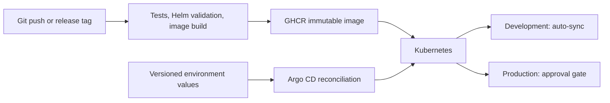

# Kubernetes GitOps Delivery Platform

[](https://github.com/L3xcy/kubernetes-gitops-delivery-platform/actions/workflows/ci.yml)
[](LICENSE)

Kubernetes GitOps Delivery Platform is an isolated platform-engineering lab that builds, validates, and promotes an observable service through local, development, and production-style Kubernetes environments with Helm, Argo CD, Podman, Kind, and GitHub Actions.

It demonstrates the complete delivery path rather than presenting a repository of disconnected YAML files: tested application code, a hardened container, environment-aware Helm packaging, Git-based promotion and rollback, restricted Argo CD applications, and automated validation.

## Capabilities

- Observable FastAPI service with health, version, and Prometheus endpoints
- Non-root multi-stage container image with a read-only runtime filesystem
- Helm chart with local, development, and production values
- Rolling updates, probes, resource limits, NetworkPolicy, and PodDisruptionBudget
- Isolated Kind cluster running through Podman on Apple Silicon or Linux
- Argo CD development auto-sync and production manual approval
- Git-first image promotion and rollback workflow
- GitHub Actions for application tests, Helm validation, container builds, and GHCR releases
- Multi-architecture `linux/amd64` and `linux/arm64` release images
- Dedicated kubeconfig guardrails that cannot use the workstation's default cluster context

## Architecture



See [docs/architecture.md](docs/architecture.md) for the environment model and safety boundary.

## Repository layout

```text
app/                         Observable demo service
charts/delivery-demo/        Helm chart and environment values
cluster/                     Dedicated Kind cluster configuration
gitops/                      Restricted Argo CD project and applications
scripts/                     Context-safe lifecycle and promotion commands
docs/                        Architecture, security, and rollback guidance
.github/workflows/           CI and multi-architecture image publishing
```

## Prerequisites

- Python 3.11 or newer
- Podman 5 or Docker-compatible container runtime
- kubectl
- Kind
- Helm

Argo CD CLI is optional; the repository installs the pinned Argo CD server manifest with context-safe kubectl commands. Argo CD `v3.4.2` is pinned for reproducibility.

## Validate without a cluster

```bash
make init
make check
make image
```

These commands run application tests, lint Python, validate all Helm value sets, render both GitOps environments, check workload security controls, and build the container image.

## Published image

Release tags publish a public multi-architecture image to GitHub Container Registry:

```bash
podman pull ghcr.io/l3xcy/kubernetes-gitops-delivery-platform:v0.1.0
```

The `v0.1.0` manifest supports both `linux/amd64` and `linux/arm64`. The production Helm values reference this immutable tag.

## Create the isolated local cluster

> Do not use an unqualified `kubectl` command on a workstation that accesses other clusters.

```bash
make cluster-create
make local-deploy
make verify
```

The scripts write only `.local/kubeconfig`, require the exact context `kind-gitops-delivery`, and pass it explicitly to every Helm and kubectl operation.

Access the service after deployment:

```bash
kubectl --kubeconfig .local/kubeconfig --context kind-gitops-delivery \
  --namespace delivery-local port-forward service/delivery-demo 8080:80
```

Then open `http://127.0.0.1:8080`, `/docs`, or `/metrics`.

## Enable the GitOps control plane

After the repository is public and the cluster has sufficient free memory:

```bash
make install-argocd
make apply-gitops
```

Development automatically prunes drift and self-heals. Production requires a manual synchronization decision. See [docs/rollback.md](docs/rollback.md) for the Git-first promotion and rollback procedure.

## Security

The workload runs without root, privilege escalation, Linux capabilities, a writable root filesystem, or a mounted Kubernetes API token. Argo CD is restricted to this repository and the two demonstration namespaces. No employer configuration, credentials, cluster endpoints, or production data are included. See [docs/security.md](docs/security.md).

## Current local validation

- Python lint passes
- Application tests pass
- Default, development, and production Helm values lint successfully
- Rendered manifests satisfy declared security controls
- The ARM64 Podman image builds and passes HTTP and metrics smoke tests

The full Argo CD deployment is intentionally deferred while the local Podman VM is hosting unrelated running workloads; the repository does not stop or modify them.

## License

MIT
