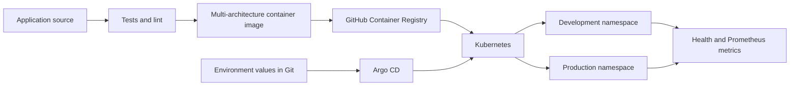

# Architecture

## Delivery flow

Application CI validates the Python service, Helm renders, and container build independently. A semantic version tag publishes an immutable multi-architecture image to GHCR. Promotion changes the declared image tag in an environment values file; Argo CD then reconciles that Git state into Kubernetes.

## Environment policy

| Environment | Replicas | Image policy | Argo CD sync |
|---|---:|---|---|
| Local | 1 | Locally loaded `dev` image | Direct Helm validation |
| Development | 1 | `main` integration image | Automatic, prune, self-heal |
| Production | 2 | Immutable release tag | Manual approval |

Production also enables a PodDisruptionBudget and larger resource guarantees. Both GitOps environments use rolling updates, probes, resource limits, and NetworkPolicy.

## Safety boundary

All local scripts load `.local/kubeconfig` and verify the exact context `kind-gitops-delivery` before calling Helm or kubectl. They never rely on the user's default kubeconfig or current context. This prevents a portfolio lab command from targeting an unrelated cluster.
